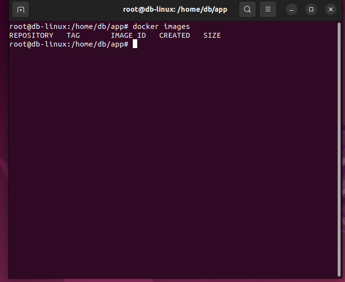
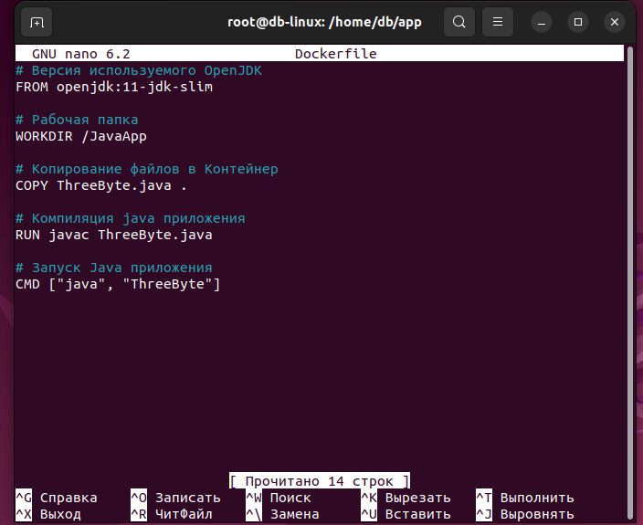
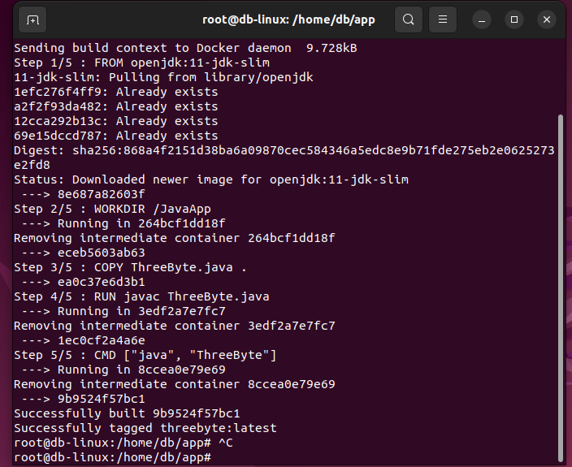
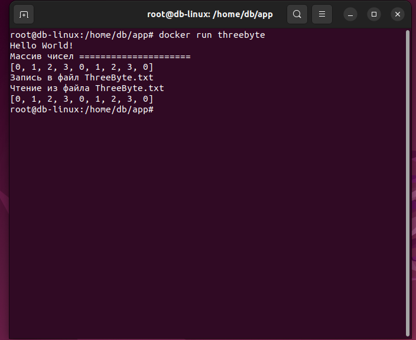
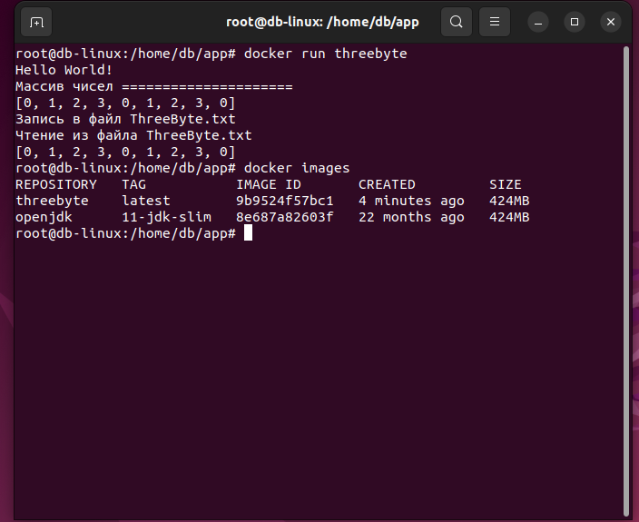
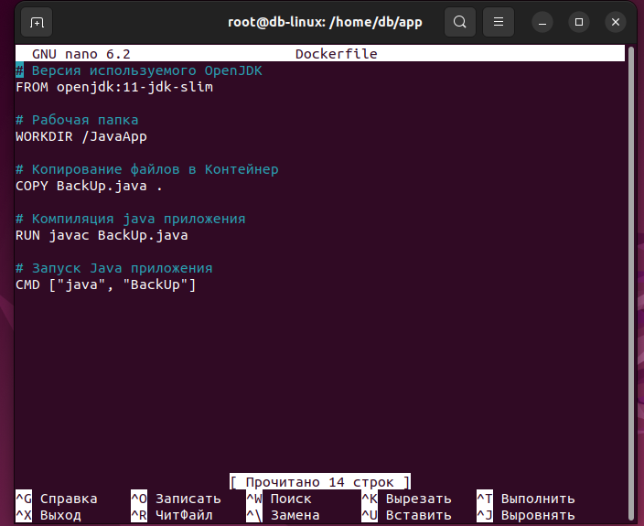
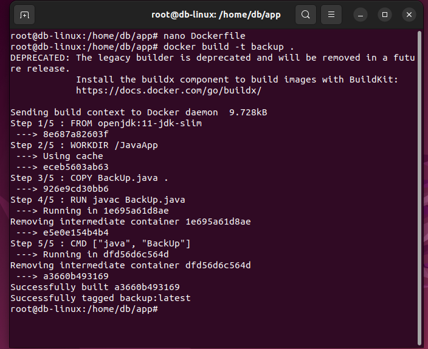
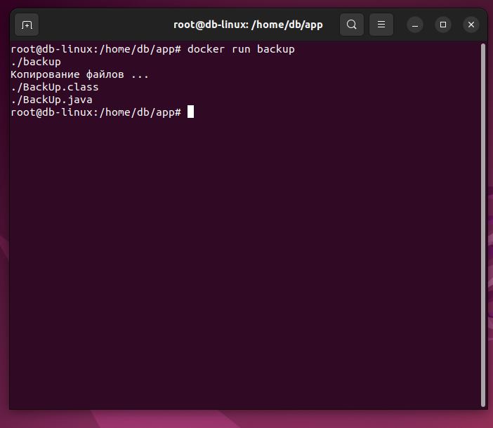
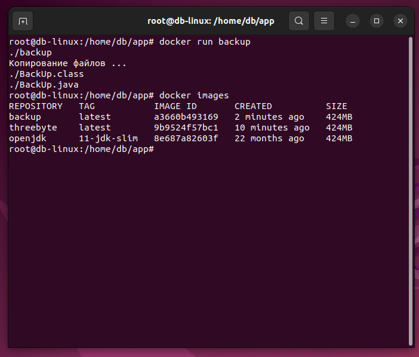

# Итоговая раота по курсу Java Core


#### 1.Предположить, что числа в исходном массиве из 9 элементов имеют диапазон[0, 3],и представляют собой, например, состояния ячеек поля для игры в крестикинолики, где 0 – это пустое поле, 1 – это поле с крестиком, 2 – это поле с ноликом, 3 – резервное значение.
#### Такое предположение позволит хранить в одном числе типа int всё поле 3х3.
#### Записать в файл 9 значений так, чтобы они заняли три байта.

#### 2.Написать функцию, создающую резервную копию всех файлов в директории(без поддиректорий) во вновь созданную папку ./backup


## Создаем два образа для заданий 1 и 2

### Задание №1

__Проверим образы Docker в системе__
```
$ docker images
```


__Создаем Dockerfile Для ThreeByte (для задания № 1)__
```
$ nano Dockerfile
```

 
```
# Версия используемого OpenJDK
FROM openjdk:11-jdk-slim

# Рабочая папка
WORKDIR /JavaApp

# Копирование файлов в Контейнер
COPY ThreeByte.java .

# Компиляция  java приложения
RUN javac ThreeByte.java

# Запуск Java приложения
CMD ["java", "ThreeByte"]
```


__Создаем образ под именем threebyte__ 
```
$ docker build -t threebyte .
```


__Запускаем созданный образ__
```
$ docker run threebyte
```
__Получим:__


__Проверим образы Docker в системе__ 
```
$ docker images
```



__Создаем Dockerfile для BackUp (для задания № 2) в редакторе nano__
```
$ nano Dockerfile
```
```
# Версия используемого OpenJDK
FROM openjdk:11-jdk-slim

# Рабочая папка
WORKDIR /JavaApp

# Копирование файлов в Контейнер
COPY BackUp.java .

# Компиляция  java приложения
RUN javac BackUp.java

# Запуск Java приложения
CMD ["java", "BackUp"]
```
<u>
Для сохраниеия файла нажимаем CTRL + O
Для выхода из режима редактирования - CTRL + X
</u>



__Создаем образ под именем backup для задания №2__
```
$ docker build -t backup .
```


__Запускаем созданный образ backup__
```
$ docker run backup
```



__Проверим образы Docker в системе__

```
$ docker images
```


